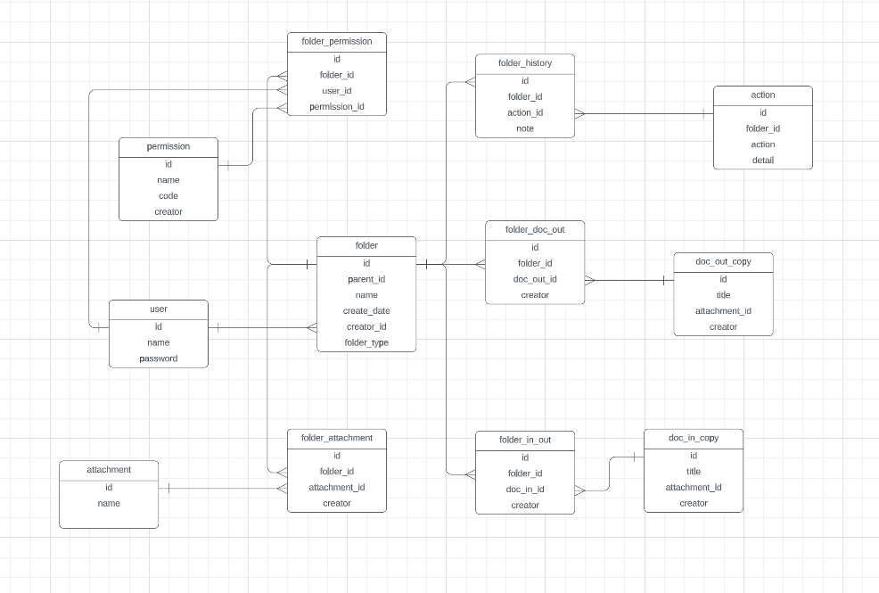

THIS IS DATABASE DESIGN FOR FOLDER

        initialize permission

        INSERT INTO mydatabase.permission (id, code, name)
        VALUES ('1', 'read', 'read');
        INSERT INTO mydatabase.permission (id, code, name)
        VALUES ('2', 'write', 'write');
        
        INSERT INTO mydatabase.user (id, user_name)
        VALUES ('1', 'admin');
        INSERT INTO mydatabase.user (id, user_name)
        VALUES ('2', 'nomal_user');
        
        INSERT INTO mydatabase.folder (id, create_date, creator_id, folder_type, is_visible, name, parent_id)
        VALUES ('1', '2023-06-12 22:08:56.000000', '1', 1, 1, 'root folder', 'root');
        
        
    requirement:
                - user can be created the new folder [x]
                - the user who create new folder will have  WRITE permission [x]
                - user can share the folder to the others people, the other who is shared the document having the READ permission

        define what the permission can do:

                - WRITE: able to upload new document, create new folder, share folder 
                - READ: only able to view the items inside shared folder
                    
       API:
        --------- folder 
                - create, update, delete, search item inside folder
               

        
        create
        post: folder
        
        update 
        put: folder
        
        delete
        delete: folder/{folderId}
        
        -----------folder-permission
        
        check permission of folder id and user id
        
        add permission for others
        
        remove

        -----------share permission for the other 

